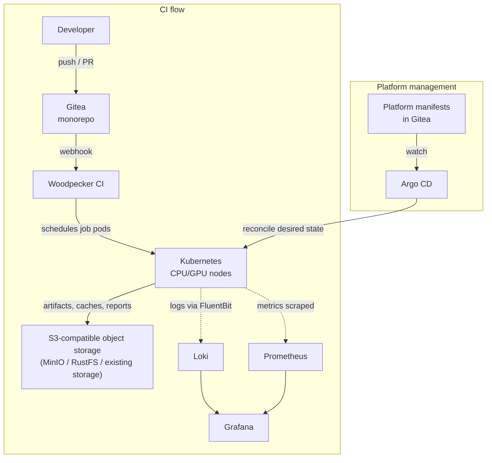

# CI/CD Concept: Lightweight On-Prem Platform for a Monorepo

## Goal
Build an open-source, on-prem CI/CD platform for one monolithic repository. The system runs on existing CPU/GPU Kubernetes nodes and storage, and must be maintainable by two employees.

## Process Overview

## Main motivation

When comparing various existing solutions, the main motivations were simplicity (since there is only 2 employees), no vendor-lock so that each component can be replaced individually (for example, Gitea has built-in Actions, but this would couple CI system to Gitea), open-source and lightweight solutions. The smaller component is, the easier it is to understand, operate, upgrade, troubleshoot, and replace.

## Component Choices
| Area | Tool | Why | Limitations | Alternatives |
|------|------|-----|-------------|--------------|
| Git hosting | Gitea | Lightweight self-hosted Git. Monorepo hosting, PRs, webhooks, Git LFS, CODEOWNERS, simple administration. | No GitHub App equivalent — only long-lived PATs and deploy keys. |  |
| CI orchestrator | Woodpecker CI | Simple hosting. Single server + agents. Steps run as pods — GPU/CPU scheduling via Kubernetes. Path filters for monorepo. | Small community, not industry standard. No reusable pipeline primitives. | Tekton would be preferable if employees have good k8s knowledge - because all Tekton resources are CRDs in Kubernetes, so purely GitOps approach + easy to share tasks.  |
| Resource management | k3s | Kubernetes CPU/GPU scheduling, requests/limits, quotas, taints/tolerations, node selectors, namespaces. Low ops weight. | SQLite default datastore not suitable for HA. Suitable more for small clusters. Less hardened than RKE2. | RKE2 |
| CD orchestrator | Argo CD | GitOps deployment, drift detection, rollback via Git revert. Manual sync approvals. Easy platform updates. | Kubernetes-only. Resource-heavy on large clusters. |  |
| Artifacts | MinIO | S3-compatible, universal tooling support. No pre-allocation. Multiple concurrent writers. Lifecycle policies. | AGPLv3 license. | RustFS - new competitor after license changed in MinIO (MinIO changed its license to AGPLv3 — not an issue for internal use, but worth noting for commercials). |
| Monitoring | Prometheus + Grafana | Standard Kubernetes monitoring. Platform health, GPU/CPU usage. Easy Helm install, huge community. | Short-term retention by default. Prometheus doesn't scale horizontally easily without extra tooling. | |
| Logging | Loki + FluentBit + Grafana | FluentBit fetches stdout logs without code changes. Same Grafana UI for logs,alerts and metrics.  | Complex regex queries are slow. Loki community support growing, but hard to find good examples/doc on syntax. queries. |   |

## Deployment and Update Process
Most of platform components are installed with Kustomize/Helm and reconciled by Argo CD. Desired state lives in Git, either in a separate platform repository or a protected platform area of the monorepo.

Example update: change the Woodpecker Helm chart/Kustomize or image version in Git, merge after review, sync with Argo CD, run a test pipeline that builds an image and uploads a generic artifact. Rollback is done by reverting the Git change.

## Benefits and Weaknesses

**Benefits.** Small, focused stack: Gitea for Git, Woodpecker for CI, Kubernetes
for CPU/GPU job scheduling, Argo CD for deployment, and S3-compatible storage
for artifacts. CI jobs run as Kubernetes pods. Monorepo builds are optimized
with path filters and optionally Nx. Updates are Git-based and easy to
review or roll back with git commits.

**Weaknesses.** Woodpecker is less common than GitLab CI or Tekton and has fewer
advanced pipeline features. The modular setup needs some integration work.
There is an initial bootstrap step: Kubernetes, Argo CD and the first Git source
must exist before full GitOps management is possible. This can be automated once
with Ansible, Pulumi or Terraform.

## Maintainability, Security and Long-Term Support

**Maintainability.** Each component has community support and can be upgraded easily (binaries or Kubernetes manifests with Helm/Kustomize). Critical state is backed up separately: Gitea repositories/metadata, object storage buckets and Kubernetes/etcd state. Components can be replaced without changing the whole architecture: Woodpecker -> Tekton, k3s -> RKE2, MinIO -> RustFS.

**Security.** CI pods run in isolated namespaces with restricted service accounts. Pipelines do not receive cluster-admin kubeconfigs. Argo CD uses pull-based GitOps. Secrets might be store in an external secret store. Access is controlled with RBAC, protected branches and pull-request reviews. GPU nodes are tainted so only authorized workloads can run there.

**User-friendliness.** Developers use normal Git workflows and simple CI YAML. The monorepo build tool reduces feedback time by running only affected tests/builds. Grafana gives one UI for metrics, alerts and logs.

**Long-term support.** The core architecture uses widely used open-source patterns: GitOps, Kubernetes scheduling, object storage for artifacts and Prometheus/Grafana observability. Less mature alternatives such as RustFS can be tested first and adopted later if they reduce operations cost without increasing risk.
